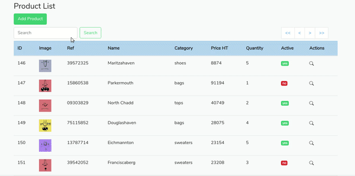

## Laravel Challenge - Product List

Simple application created using Laravel and ReactJS. To use it you'll need PHP > 7, Composer and nodeJS > 12 installed in your machine. After that just run `composer install` to install all dependencies

To run locally, type de command line `php -S localhost:8081 -t public/` and in another terminal run `npm run dev` to build the frontend. Now just access the application on the browser.

If you want to run the integration tests, just type the command line `php artisan test`

Feel free to do a code review and suggest improvement :)
